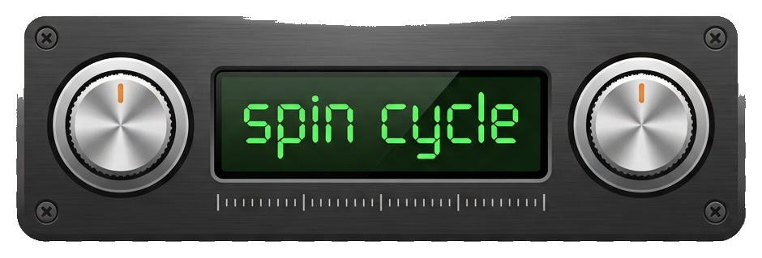

<p align="center">
  
</p>

# Spin Cycle

Spin Cycle is a music video jukebox for a Raspberry Pi 4, controlled from a
web app in your browser -- desktop or mobile, no app install needed. Pick a genre and
an era and it starts playing a shuffled, continuously-looping set of music
videos on the connected TV over HDMI (once every track's played, it
reshuffles and keeps going). Videos are sourced from YouTube via yt-dlp
and lazily cached to local storage so playback never depends on the
network once a video's been played once.

**Status:** software (caching, playback, library, web remote) works
today. A 3D-printed case with physical rotary dials and an LCD was the
original plan for this project and may still happen -- see the
[Appendix](#appendix-3d-printed-case--physical-controls) for that.

## Hardware

- Raspberry Pi 4 (any RAM size), HDMI to TV
- External USB 3 SSD for the video cache (don't use the SD card for this)

## Setup on the Pi (Raspberry Pi OS 64-bit)

The Spin Cycle app itself lives in [`app/`](app/): a device-agnostic
codebase with a `Dockerfile`, no assumptions baked in about which machine
it runs on. Per-target install scripts live under `deploy/` -- today
that's [`deploy/raspberrypi/`](deploy/raspberrypi/); a different device or
deployment method later would be a new sibling folder that builds the
same `app/` image rather than a fork of the codebase. Clone the repo
anywhere your user can write -- no fixed install path required:

```
git clone <repo-url> spincycle
cd spincycle/deploy/raspberrypi
./install.sh
```

`install.sh` does everything by hand-setup used to require:

- installs **Podman** (a daemonless container runtime -- ships directly in
  Raspberry Pi OS's own apt repo, no third-party repo needed)
- forces 720p HDMI output by editing `config.txt` and `cmdline.txt` in
  `/boot/firmware` (older Raspberry Pi OS: `/boot`) -- see "Customizing
  the HDMI resolution" below for *why* three separate places need this
  if you ever need to change it
- builds the spincycle container image from `app/`
- installs and enables a systemd service (`spincycle.service`, generated via
  `podman generate systemd`) that runs Spin Cycle as a **privileged**
  container -- broad host device access (GPU/DRM, V4L2 hardware decode,
  ALSA, the physical console) in exchange for not having to hand-enumerate
  exact device nodes. Consistent with the trust level already implied by
  the web remote having no authentication -- this is a single-purpose LAN
  appliance, not a multi-tenant server.
- also bind-mounts the host's `/usr/share/alsa` into the container
  read-only. Device *node* access (`/dev/snd`) isn't enough on its own --
  Raspberry Pi OS's `alsa-utils`/`libasound2` build ships card-specific
  config (`/usr/share/alsa/cards/vc4-hdmi.conf`) that the container's
  plain-Debian base image doesn't have, and without it ALSA's format
  negotiation against `vc4-hdmi` fails even though the device is visible.
  Confirmed by testing on real hardware: video (DRM/V4L2) worked from the
  first container run with no changes needed; audio needed this fix.

It prompts for confirmation before editing boot files or installing the
service, and prompts for your video cache location (see below). Non-
interactive re-runs (e.g. after a `git pull`) can skip both prompts:

```
./install.sh --cache-root=/media/pi/SPINCYCLE/spincycle_cache --yes
```

Re-run `install.sh` any time you update the code -- every step is
idempotent (it won't duplicate boot config lines, and it rebuilds the
image and recreates the systemd service cleanly even if one's already
installed), which doubles as the upgrade path after a `git pull`.

Once it's done, the service is already enabled and running:

```
sudo systemctl status spincycle     # is it up?
journalctl -u spincycle -f          # live logs
sudo systemctl restart spincycle    # after editing config.py, etc.
```

A few things are still manual, since they're about your specific setup
rather than anything `install.sh` can decide for you:

1. **Video cache location.** `install.sh` prompts for your external USB
   SSD's mount point (e.g. `/media/pi/SPINCYCLE`) and bind-mounts it into
   the container at `/cache` (`SPINCYCLE_CACHE_ROOT=/cache` inside the
   container). You can leave it blank at install time and set it later
   from the web remote's Settings panel ("Cache storage location")
   instead -- that takes effect immediately (no restart) and is
   remembered in `config/settings.json`, which then takes priority.
   Without either one set, the container falls back to a local dir under
   `deploy/raspberrypi/data/cache` -- it's `.gitignore`'d and works
   everywhere, but it lives on the SD card, which defeats the point of
   using an external drive (see "Target hardware" in `CLAUDE.md`). Don't
   leave it there for real parties; a bad or unmounted path is never
   fatal (the web remote still comes up so you can fix it), and the main
   page shows a warning banner whenever the configured cache folder isn't
   actually usable.

2. **Add your videos to `config/library.csv`.** It's a plain CSV with
   these columns (header row required):
   ```
   artist,song,genre,era,url
   Example Artist,Example Song,Rock,80s,https://www.youtube.com/watch?v=XXXXXXXXXXX
   ```
   Open it in any text editor or spreadsheet app -- no need to hand-write
   JSON structure. Rows missing a genre, era, or url are skipped with a
   warning rather than breaking the app. A starter library of 18 well-known
   tracks across Rock/Pop/Hip-Hop and the 80s/90s/2000s ships in the repo.
   `install.sh` bind-mounts `app/config` into the container (rather than
   baking it into the image), so edits here -- by hand, `git pull`, or via
   the web UI upload below -- take effect on the next `sudo systemctl
   restart spincycle` without rebuilding the image, and persist across
   image rebuilds.

   Instead of editing the file directly on the Pi (scp/git pull), open the
   web remote's Settings panel from any browser on your LAN at
   `http://<pi-ip>/` (or `http://raspberrypi.local/` -- Raspberry Pi OS
   runs Avahi/mDNS by default, so the `.local` hostname resolves on the LAN
   without knowing the Pi's IP) and download/upload `library.csv` from
   there. Uploads are validated before being accepted, so a malformed CSV
   never overwrites the live one. **No authentication** -- LAN-only, same
   trust level as ssh.

3. **(Optional but recommended) Pre-warm the cache** so party night
   doesn't depend on your internet connection:
   ```
   sudo podman run --rm -v "$PWD/../../app/config:/app/config" \
     -v "$PWD/data/cache:/cache" -e SPINCYCLE_CACHE_ROOT=/cache \
     spincycle:latest python3 video_cache.py
   ```
   (adjust the cache volume path to match whatever you gave `--cache-root`
   at install time). This walks the whole library and downloads anything
   not yet cached, printing progress as it goes. Safe to re-run any time
   you add new URLs -- already-cached videos are skipped instantly. The
   web remote's Settings panel also has a "Warm cache" button that does
   this remotely, with a live progress line and a scrollable log of
   anything that failed to download.

### Customizing the HDMI resolution / connector

`install.sh` defaults to forcing 720p on `HDMI-A-1` (auto-detecting a
different connected port and warning you if it finds one). You shouldn't
need to touch this unless you're changing resolution or moving the TV to
the Pi's other HDMI port, but it's worth understanding *why* it takes
three separate places to actually stick, in case something needs
hand-tuning:

1. **Firmware-level boot splash** -- `hdmi_force_hotplug=1` /
   `hdmi_group=1` / `hdmi_mode=4` in `config.txt` (`hdmi_mode=4` is
   1280x720@60Hz in the CEA mode table, the right table for a TV rather
   than a PC monitor). This alone only covers the firmware splash, though.
2. **Kernel/KMS-level lock** -- with the full `vc4-kms-v3d` KMS driver
   this project requires (see `CLAUDE.md`'s "Target hardware"), the
   kernel's DRM driver does its own EDID negotiation once Linux takes
   over and reverts to the TV's preferred (usually highest) mode,
   ignoring `hdmi_mode`. That's the "starts at 720p, then jumps back up"
   symptom. Locking the post-boot mode needs a `video=HDMI-A-1:1280x720@60D`
   argument appended to `cmdline.txt` (single line, no newline inserted).
   The `D` suffix forces that exact timing rather than a fallback hint the
   driver can still override. If you move the TV to the Pi 4's other HDMI
   port, re-run `install.sh` (it re-detects the connector) or edit
   `cmdline.txt` by hand with `HDMI-A-2`. Check which connector is live:
   ```
   for f in /sys/class/drm/card*-HDMI-*; do echo "$f: $(cat $f/status)"; done
   ```
   Reboot after editing. Confirm the active mode with `dmesg | grep -i
   drm` or `modetest -c` (from `libdrm-tests`) -- don't rely on
   `tvservice`, it's a legacy-firmware-driver tool and doesn't reflect
   reality under `vc4-kms-v3d`.
3. **mpv's own DRM output** -- even with 1 and 2 locked, mpv's
   `--gpu-context=drm` defaults `--drm-mode` to `preferred`, re-reading
   the TV's EDID and requesting its highest-resolution mode the instant
   mpv opens the display, independent of the `cmdline.txt` lock. That's
   why the TV can jump back to 4K (and drift out of audio/video sync)
   specifically when a track starts playing. `config.py`'s
   `DRM_CONNECTOR`/`DRM_MODE` pin mpv to the same connector/mode as
   `cmdline.txt` -- **`install.sh` does not edit this file**; if you use a
   non-default connector or resolution, update `DRM_CONNECTOR`/`DRM_MODE`
   in `app/config.py` by hand to match, then `sudo systemctl restart
   spincycle` (no image rebuild needed if you only touched `config.py`
   values that are read at runtime -- but note `config.py` itself *is*
   baked into the image, so a source change here does need a re-run of
   `install.sh` to rebuild). Use `mpv --drm-connector=help` /
   `--drm-mode=help` on the Pi to see valid values for your hardware.

## Setup on k3s (web deployment)

Spin Cycle also runs as a web-only deployment -- no mpv, no physical
console, no DRM/ALSA -- where a browser tab you launch from the web
remote becomes the player instead. Same `app/` image as the Pi target,
just a different `deploy/` sibling and one env var
(`SPINCYCLE_PLAYBACK_MODE=web`) that swaps the mpv-on-console `Player` for
a `BrowserPlayer` (see `player.py`/`config.py`). This is meant for a
multi-viewer home cluster rather than a single physical device, so it adds
**sessions**: each browser tab/device gets its own independent genre/era
selection and player, named things like `clever-otter` (see `sessions.py`).
The web remote's landing page becomes a session picker -- **+ New
Session**, **Select** to open a session's genre/era/skip/stop controls
plus a **Launch Player** button, **Close** to tear one down. Console mode
is untouched by any of this -- it still boots straight into today's
single-controller UI, no picker.

Unlike the Pi target, this one's actual Kubernetes manifests and ArgoCD
`Application` live in the separate `myhomelab` GitOps repo that manages
this cluster (`k8s/base/spincycle/` + `k8s/apps/spincycle.yaml` there) --
consistent with every other app on that cluster, and it means ArgoCD
doesn't need a new cross-repo credential. This repo only builds and
publishes the image:

```
git push                                # any push to app/** builds + pushes
                                         # ghcr.io/davisc01/spincycle:latest via
                                         # .github/workflows/build-k3s-image.yml
kubectl rollout restart deployment/spincycle -n spincycle   # pick up a new image
```

See [`deploy/k3s/README.md`](deploy/k3s/README.md). A few differences from
the Pi target worth knowing:

- **No hardware decode constraint.** `config.FORMAT_SELECTOR` only forces
  H.264/1080p in console mode, for the Pi's V4L2 decoder. Web mode decodes
  client-side in the viewer's own browser, so it uses a much looser
  selector (up to 4K, any codec) for noticeably better quality.
- **Storage is two `local-path` PVCs**, not a bind-mounted USB drive: one
  for the video cache, and a small one for `app/config` (`library.csv`/
  `settings.json`) so a library uploaded through the web UI survives a
  pod restart. `local-path` is this cluster's only StorageClass (k3s
  built-in, node-local) -- fine here since the cluster is single-node.
- **Single replica only.** Sessions live in the running pod's memory
  (`SessionManager`), so a second replica would split traffic across two
  independent, inconsistent session sets.
- **No GPU use yet**, despite one being available on this cluster's node
  (already used by Jellyfin there via a `/dev/dri` hostPath mount) --
  documented as a follow-up: a one-time GPU-accelerated transcode step in
  `video_cache.ensure_cached()` (AMD/VAAPI) could normalize whatever
  codec/resolution YouTube served down to a consistent cached file,
  independent of the format-selector change above.

### `/dev/tty1` and the console splash

`main.py` prints a retro "Spin Cycle" splash and tries to write it
directly to the physical console (`/dev/tty1` by default, see
`config.CONSOLE_TTY`) so the idle screen looks like part of the device on
the TV, not just in your SSH session -- mpv already renders straight to
that display over DRM/KMS regardless of how the process was launched, so
the splash does the same. Current Raspberry Pi OS ships `/dev/tty1` as
`root`-only (`crw-------`) -- console access is granted dynamically per
logged-in session rather than via static group permissions, so a
non-root process on the host can't normally open it. The container
sidesteps this entirely: `spincycle.service` runs the container as a
privileged root process, which can open `/dev/tty1` directly, no
`TTYPath=` dance needed the way a bare host process would.

## Using the web remote

Open `http://<pi-ip>/` (or `http://raspberrypi.local/`) in a browser on
your laptop or phone -- it works the same on desktop and mobile, no app
install needed. `main.py` starts a `SpinCycleController` and drives it from
this browser-based remote: a genre `<select>`, an era `<select>`, and
Skip/Stop buttons.

Picking a genre and an era starts playback automatically -- no separate
confirm step, since picking from a dropdown is already a deliberate
action. Changing either selection mid-playback re-tunes: stops the
current video and starts the new combination. Skip moves to the next
track without changing the selection; Stop halts playback and returns to
browsing. A Settings button opens the library upload/download, cache-warm
trigger, and cache/playback log panels covered in "Setup on the Pi" above.

Both the genre and era lists have one extra entry past the real values:
**"Anything"** (genre) and **"Anytime"** (era). Picking either relaxes that
half of the match -- e.g. genre `Rock` + era `Anytime` plays all Rock
regardless of era; `Anything` + a specific era plays that era across every
genre; `Anything` + `Anytime` shuffles the entire library.

## Project layout

- [`app/`](app/) - the Spin Cycle codebase itself, device-agnostic. Builds
  one container image (`app/Dockerfile`) that every `deploy/` target
  runs. All paths below are relative to `app/` unless noted.
- [`deploy/raspberrypi/`](deploy/raspberrypi/) - `install.sh` (see "Setup
  on the Pi" above) plus its gitignored `data/` dir (fallback cache when
  no `--cache-root` is given).
- [`deploy/k3s/`](deploy/k3s/) - just a README pointing at the GitHub
  Actions workflow (`.github/workflows/build-k3s-image.yml`) that
  publishes this target's image; the actual manifests live in the
  `myhomelab` GitOps repo (see "Setup on k3s" above). Both `deploy/`
  targets build and run the same `app/` image -- a future deployment
  target would be a new sibling here too, rather than forking the
  codebase.
- `config.py` - paths, yt-dlp format string, mpv settings. Edit this first.
- `config/library.csv` - your actual video library: artist, song, genre,
  era, url. Easiest file to hand-edit; open it in any text editor or
  spreadsheet app.
- `library.py` - loads `library.csv` into the genre -> era -> tracks
  structure, and resolves a genre/era pick (including the
  "Anything"/"Anytime" wildcards) into a track list. Also runnable
  standalone to sanity-check the file (`python3 library.py`).
- `video_cache.py` - lazy caching layer. Also runnable standalone to
  pre-warm the whole library (`python3 video_cache.py`).
- `controller.py` - `SpinCycleController`, the live playback engine behind
  the web remote: tracks the current genre/era/track, and shuffles/plays/
  skips/stops on a background thread as selections change. Logs each
  track play/skip/error to `config.PLAYBACK_LOG`. Intentionally decoupled
  from `input_device.py`'s `Event` model so a future GPIO dial input could
  drive it too. Instance-scoped with no module-level globals, which is
  what lets `sessions.py` run many of them concurrently in web mode.
- `sessions.py` - `SessionManager`, web-mode only: owns one
  `SpinCycleController` per session, keyed by a random adjective-animal
  name (e.g. `clever-otter`) that doubles as its id. Not used in console
  mode -- `main.py` wires up a single bare `SpinCycleController` there.
- `library_server.py` - LAN-only web server for the whole web remote:
  serves `web/` (`index.html`/`style.css`/`app.js`/`player.html`/
  `player.js`), a JSON API backed by either a single `SpinCycleController`
  (console mode: `/api/status`, `/api/genre`, `/api/era`, `/api/skip`,
  `/api/stop`) or a `SessionManager` (web mode:
  `/api/sessions`, `/api/sessions/<name>/status`, `/api/sessions/<name>/
  {genre,era,skip,stop,video-ended,close}`), a range-request-capable
  `/video/<file>` route serving cached videos to browser players, and the
  library-management routes (`/upload`, `/library.csv` download,
  `/warm-cache`). `main.py` starts it automatically in a background
  thread; it's also runnable standalone (`python3 library_server.py`) for
  library maintenance without full playback (the controller-backed routes
  503 in that mode).
- `web/` - the browser UI: `index.html`/`style.css`/`app.js` (the remote --
  vanilla JS, no build step, polls `/api/status` or, in web mode, the
  session picker + `/api/sessions/...`), and `player.html`/`player.js` (the
  web-mode browser player, opened via "Launch Player" -- polls a session's
  `video_url` and plays it in a `<video>` tag).
- `player.py` - `Player` (mpv subprocess wrapper: play / skip) and
  `BrowserPlayer` (web mode: blocks until the browser player tab reports
  the video ended or skip is pressed). `make_player()` picks between them
  based on `config.PLAYBACK_MODE`.
- `input_device.py` - input abstraction. `KeyboardInput`, built for a
  discrete menu model, not used by `main.py` -- see the Appendix.
- `menu.py` - dev/testing-only terminal keyboard mockup, superseded by
  the web remote -- see the Appendix.
- `main.py` - entry point, dependency check, creates the
  `SpinCycleController` and starts `library_server.py` in the background,
  then just waits (the web remote owns all interactivity).

## Why H.264, not VP9/AV1 (console mode only)

The Pi 4's V4L2 M2M hardware decoder handles H.264 (and HEVC) but not
VP9/AV1, which is what YouTube serves by default at higher resolutions.
In console mode, `config.FORMAT_SELECTOR` forces yt-dlp to grab the H.264
variant of each video so playback stays hardware-accelerated instead of
falling back to slow software decode. This constraint doesn't apply to
the k3s/web deployment target -- there, decoding happens client-side in
the viewer's own browser rather than on the server, so web mode uses a
looser selector (up to 4K, any codec) instead. See "Setup on k3s" above.

## Appendix: 3D-printed case & physical controls

The original plan for this project was a 3D-printed case styled like an
old car stereo, with two rotary dials up front (genre on the left, era on
the right) and a horizontal 16x2 LCD in the middle -- turn the dials like
tuning a radio, stop turning, and it starts playing. The web remote above
turned out to be a much better interface (works from any phone/laptop
already on the LAN, no soldering required), so the physical build is on
hold, not gone. This section captures the design so it doesn't get lost.

### Hardware (on order, not yet on the bench)

- 16x2 I2C LCD (HD44780 controller + PCF8574 backpack) -- top row shows
  the live genre/era selection, bottom row shows status/errors
- 2x bare-shaft EC11 rotary encoders (5-pin: CLK, DT, SW, +, GND),
  panel-mounted through the case front -- left dial = genre, right dial =
  era
- Breadboard + jumper wires for prototyping; perfboard + headers for the
  final solder-down once the wiring's proven out

### Radio-tuner interaction model

- Turning the **genre dial** (left) live-updates the genre shown on the
  LCD. Turning the **era dial** (right) live-updates the era. No
  confirmation press needed for either.
- Once both dials have been still for about a second, that combination is
  considered selected and Spin Cycle automatically starts caching and
  playing a shuffled set -- the LCD's bottom row shows "loading..." then
  the current track.
- Turning either dial again -- even mid-playback -- stops the current
  video and drops back into live browsing, like re-tuning a station.
- **Genre dial's push-button** = skip the current track.
- **Era dial's push-button** = stop playback and return to browsing.
- Each dial has one extra detent past its real values -- "Anything" on the
  genre dial, "Anytime" on the era dial -- for playing across whichever
  half you leave wide open, same as the web remote's wildcard options.

This means the dials' built-in push-buttons are *not* used to confirm a
genre/era pick -- only for skip and stop, since selection happens
automatically once you stop turning.

### Current dev stand-in: terminal keyboard mockup

`menu.py` + `input_device.py` are a terminal keyboard mockup of a discrete
browse-a-list-then-confirm menu, left over from before the web remote
existed:

| Key            | Action                        |
|----------------|--------------------------------|
| w / Up arrow   | Rotate one direction (move up)  |
| s / Down arrow | Rotate other direction (move down) |
| Enter / Space  | Push the selector button (confirm) |
| k              | Press the skip button (next track) |
| q              | Back out of a menu / stop playback and return to menu |

It's dev/testing-only -- run it directly with `python3 menu.py` from a
local Python environment with `requirements.txt` installed and `mpv` on
your `PATH` (not something `deploy/raspberrypi/install.sh` sets up, since
the container is the production path); `main.py` no longer starts it,
since running it alongside the web remote would mean two independent mpv
processes fighting over the same screen and speaker.

### Moving to the rotary encoders and LCD

The current `menu.py`/`input_device.py` pair is built around a
press-to-confirm menu tree (`NEXT`/`PREV`/`SELECT`/`SKIP`/`QUIT` events),
which doesn't map cleanly onto "two continuously-live dials with
settle-based auto-commit." Rather than bolting the radio-tuner behavior
onto the old event model, both files get rewritten together around:

1. A **settle timer** per dial -- each rotation resets a "last moved"
   timestamp; a dial is "locked" once ~700ms-1000ms pass with no movement.
2. An `RPLCD`-based display layer for the 16x2 I2C LCD (top row = live
   genre/era, bottom row = status/errors).
3. `gpiozero.RotaryEncoder` + `gpiozero.Button` for the two dials and
   their push-buttons.

`player.py` and `video_cache.py` stay as-is -- this rework is scoped to
the input/menu layer only.
